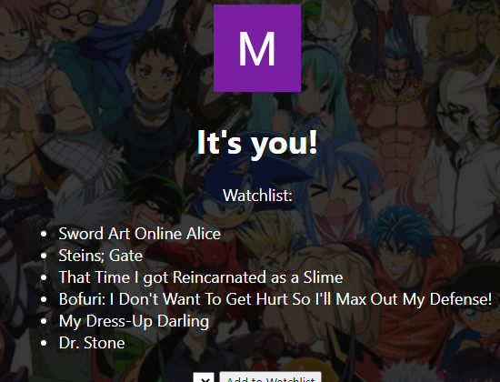
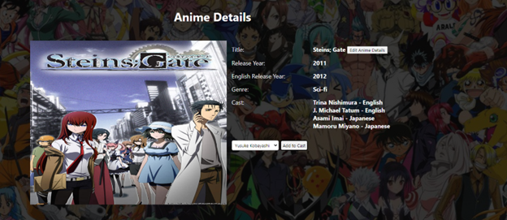

# Anime-Review-King!

Pre-Covid, I never really cared about Anime but once all the live TV shows went on hiatus, I ended up falling in love with it again and started asking everyone I knew for recommendations. 

# [Try it here!](https://anime-review-masters.fly.dev/)

# [Here's how I planned it out](https://trello.com/b/glUQw0ps/review-rave-site#)

This is a site that I created for anime fans. You can create, review and update Anime as well as check out other users and their watchlists. 

# Technologies Used
- MongoDB
- Express
- EJS
- git
- HTML
- JavaScript
- CSS

# [Attributions and Thanks](./attributions.md)

# Icebox 
 - [X] Adds Watchlist.
-  [ ] Dark/Light mode. 
-  [X] Genre.
-  [ ] Add search functionality.
-  [ ] Add friends list. 
-  [ ] Split Voice actors into different lists depending on sub/dub.
-  [ ] Refactor watch list functionality to place a button on the anime page as opposed to the user profile.  